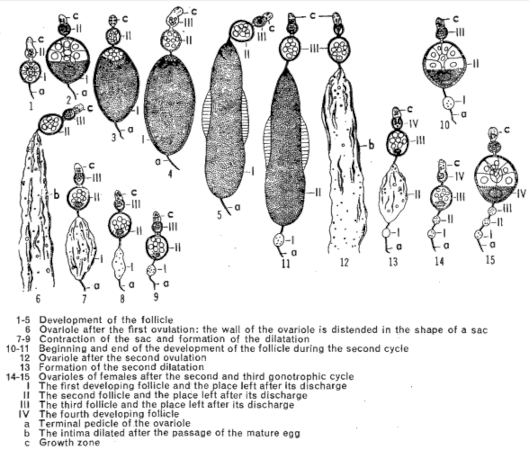

```{r setup, include=FALSE}
options(htmltools.dir.version = FALSE)
knitr::opts_chunk$set(
  fig.width=9, fig.height=3.5, fig.retina=3,
  out.width = "100%",
  cache = FALSE,
  echo = TRUE,
  message = FALSE, 
  warning = FALSE,
  hiline = TRUE
)
```

```{r xaringan-themer, include=FALSE, warning=FALSE}
library(xaringanthemer)
style_duo_accent(
  primary_color = "#1381B0",
  secondary_color = "#FF961C",
  inverse_header_color = "#FFFFFF"
)
```

background-image: url(./img/MIVEGEC-home-page.png)
background-size: cover

.footnote[<https://mivegec.fr>]

---

class: center, middle

This presentation is available online at

<https://costantinicarlo.github.io/Vector-Anopheles>

(use top/down/left/right keyboard arrows, and click on links to navigate)

---

# Taxonomic background

.pull-left[

- Phylum: Arthropoda

  - Class: Insecta
  
      - Order: Diptera

          - Family: Culicidae (3 719 recognized species as of `r Sys.Date()`: <https://mosquito-taxonomic-inventory.myspecies.info/valid-species-list>)

              - Subfamily:
      
                  1. Anophelinae
        
                  2. Culicinae

]

.pull-right[


]

---

# Why only some *Anopheles* mosquitoes transmit the malarial *Plasmodium* parasites?

There are **508 recognized species** of *Anopheles* (as of `r Sys.Date()`: <https://mosquito-taxonomic-inventory.myspecies.info/valid-species-list>), but **only about 10%** are seriously implicated in **malaria transmission**.

Why?

--

Because of 4 factors:

3. Susceptibility to infection

--

1. Abundance

--

2. Contact with humans

--

4. Longevity

---
class: inverse center middle

# Susceptibility to infection

---

## Vector–Parasite co-evolution

Whenever sufficient stable conditions persist allowing contact among the vector, the host, and the parasite over prolonged periods of time, susceptibility to infection is almost never a bar to a species acting as a vector, provided it is sufficiently abundant, human-biting, and long-lived.

--

**Given enough time**, a parasite will **adapt** to the most prevalent human-biting mosquitoes of a particular region.

--

Land-use and climate changes, or human migrations introducing foreign parasite strains may limit the susceptibility of an otherwise potent vector.

--

**Examples**

*A. maculipennis*, *A. atroparvus*, and *A. labranchiae* in Europe failed to become infected with Indian or African strains of *P. falciparum* (James 1932; Ramsdale & Coluzzi 1975)

--

According to Bruce-Chwatt & de Zulueta (1980) *P. falciparum* did not invade the Mediterranean until it could adapt to *A. maculipennis* during the early centuries of the Christian era.

---
class: inverse center middle

# Abundance

---

## Abundance / Determining factors

.pull-left[

- [Larval ecology](#larval_ecology)

--

- Human activities

	- Irrigation

	- Deforestation (*A. gambiae* in tropical Africa *vs.* *A. balabacensis* in South-East Asia)

	- Urbanisation
	
]
	
.pull-right[
	


]

---
name: larval_ecology

### Abundance / Determining factors / Larval ecology

.pull-left[


]

--

.pull-right[


Rainforest rivers in the Peruvian Amazon 


Mangrove in southern Senegal

]

---

## Methods to estimate mosquito absolute abundance

- Field quadrats

	- *A. pessoai* in Colombia grasslands: 1 000--2 500/ha  (de Zulueta 1952)
	
--

- House surveys

	- *A. gambiae* and *A. funestus* in Tanzania: 1 000/ha (in 160 ha) (Gillies 1955)
	
--

- Mark-Release-Recapture experiments

	- *A. gambiae s.l.* **females** in Burkina Faso: 375--875/ha (in 400 ha) (Costantini *et al.* 1996)

	- *A. quadrimaculatus* 20 000--37 000/ha (in 160 ha) (Eyles & Cox 1943)

---
class: inverse center middle

# Contact with humans

---

## Host selection 1

> The **proportion of feeds** that a species of *Anopheles* takes **on humans** is the single **most important** character determining its role as a **vector**. ---Gillies, 1988

--

Host-feeding patterns in mosquitoes can be **broadly** categorized in:

--

1. species feeding on mammals (=> *Anopheles*)

--

2. species feeding on birds

--

3. species feeding on both mammals and birds

--

4. more esoteric (and often occasional) feeding habits: amphibians and reptiles (*Uranotenia* spp.), fishes (*Periophthalmus*), invertebrates (molluscs, arthropods)

---

## Host selection 2

.pull-left[

- feral *Anopheles* do not feed on humans or domestic animals

	- cave-dwelling species like *A. hamoni* feed on **bats** in Central Africa (Adam 1965)

	- *A. smithii* feed on **porcupines** and **fruit-bats** in West Africa (Mouchet 1957; Brady 1965)

	- *A. machardyi* feed on **antelopes** in East Africa (Gillies & de Meillon 1968)

	- *A. hackeri* and *A. pujutensis* feed on **monkeys** in Malaya (Reid & Weitz 1961)

	- *A. freeborni* and *A. franciscanus* feed on **hares** and wild **rabbits** in Western USA (Tempelis 1974)

]

--

.pull-right[

- some species feeding on human or domestic animals in anthropic environments can feed on wildlife in feral habitats (Makanga *et al.* 2016)


]

---

## Host selection 3

**Human Blood Index** (HBI): proportion of freshly fed *Anopheles* found to contain human blood.

|  HBI > 0.5            | 0.1 < HBI < 0.5        | HBI < 0.1                  |
| :-------------------- | :--------------------- | :------------------------- |
| *A. farauti* ++       | *A. culicifacies* +    | *A. algeriensis*           |
| *A. funestus* +++     | *A. messeae* +         | *A. aconitus* +            |
| *A. gambiae s.l.* +++ | *A. quadrimaculatus* + | *A. annularis*             |
| *A. koliensis*        | *A. rufipes*           | *A. mascarensis*           |
| *A. nili*++           | *A. sergentii*+ +      | *A. multicolor*            |
|                       | *A. sinensis* +        | *A. subpictus malayensis*  |
|                       | *A. sundaicus* ++      |                            |
+, ++, +++: importance as vectors (Garret-Jones 1964)

---

## Host selection / Determinants of host selection

--

1. Innate host-specific tendencies of the vector

--

2. Host availability

--

3. Host accessibility

  - Flight pattern and ecology of the vector

---

### Host selection / Innate host-specific tendencies of the vector 1

Trials with man and calf in separate bed-net traps in Burkina Faso, West Africa

|                 || % of feeds on man          |
| :-------------- | :------------------- | ---: |
| **Vectors**     | *A. funestus*        | 84   |
|                 | *A. gambiae s.l.*    | 77   |
|                 | *A. nili*            | 65   |
| **Non-vectors** | *A. flavicosta*      | 24   |
|                 | *A. pharoensis*      | 13   |
|                 | *A. coustani*        | 12   |
|                 | *A. squamosus*       | 10   |
|                 | *A. brohieri*        |  4   |
|                 | *A. rufipes*         |  1   |

.footnote[from: Hamon *et al.* (1964)]

---

### Host selection / Innate host-specific tendencies of the vector 2

Trials in Malaysia, South-East Asia, with man and calf in separate net-traps, and on human bait indoors and outdoors (From: Reid 1968).

| | Simultaneous catches on man and calf (% on man) || Simultaneous catches on man, indoors and outdoors (% indoors) |
| :-------------- | :------------------- | -----: | -----: |
| **Vectors**     | *A. b. balabacensis* |     84 |     42 |
|                 | *A. campestris*      |     77 |     76 |
|                 | *A. maculatus*       |     41 |     23 |
|                 | *A. letifer*         |     38 |     13 |
|                 | *A. umbrosus*        |     29 |        |
|                 | *A. sundaicus*       |     12 |     29 |
| **Non-vectors** | *A. separatus*       |      7 |      2 |
|                 | *A. barbirostris*    |      6 |        |
|                 | *A. lesteri*         |      2 |      0 |
|                 | *A. vagus*           |      1 |        |

???

contact with humans is much closer if, in addition to feeding preferentially on them, a vector has the ability to penetrate indoors so that both early and late-feeding individuals or genotypes take part in transmission.

---

### Host selection / Host availability

> Many species of *Anopheles* will feed on whatever large mammal is available. For example some 80% of the species in the Afrotropical anopheline fauna could be described in this way.

--

Factors affecting the probability of host contact:

1. Habitat overlap

	- [forest workers](#orpaillage) (*A. dirus* in South-East Asia, *A. darlingi* in the Amazon forest)

	- [urban *vs.* rural vectors](#urban_stephensi) (*A. stephensi* in India, *A. claviger* in Syria and Lebanon)
	
--

1. [Relative abundance](#FeedingRatio)

--

2. Size

---
name: orpaillage
class: center, middle

#### Gold mining in the Amazon forest of French Guyana


.footnote[*image source*: <https://www.wwf.fr>]

---
name: urban_stephensi
class: center, middle

#### Urban larval habitats of *A. stephensi* in Djibouti


.footnote[*image source*: <https://doi.org/10.3201/eid2706.204557>]

---
name: FeedingRatio

#### Host selection / Host availability / Relative host abundance

##### Feeding Ratio or Feeding Index:

statistics taking into account not only the relative abundance of different hosts but also the concurrence of hosts and vectors in space and time, the feeding success of mosquitoes, and the relative sizes of hosts.

--

Proportion of blood meals taken by *A. arabiensis* either on bovines or on humans in two villages from southern Ethiopia with contrasting relative abundances of these alternative hosts


.footnote[from Tirados *et al.* 2006]

---

### Host selection / Host accessibility

1. [Indoors *vs.* outdoors](#house_entering)

--

2. Under [bed nets](#bednets)

--

3. Defensive behaviour

--

4. At ground *vs.* canopy level

---
name: house_entering

#### Host selection / Host accessibility / House entering behaviour

**Experimental approach**

.pull-left[


]

.pull-right[


]

.footnote[from: Snow 1987]

---

#### Host selection / Host accessibility / House entering behaviour

**Results**


.pull-right[.footnote[from: Snow 1987]]

---
name: bednets

#### Host selection / Host accessibility / Bed nets

.pull-left[


]

.pull-right[


]

---
class: inverse center middle

# Longevity

---
class: center middle

### epidemiologically dangerous mosquitoes <br> = <br> older fraction of the female vector population

---
class: center middle


---

## Longevity 1

**Sporozoite rate** ( $s$ ): proportion of *Anopheles* harbouring sporozoites in their salivary glands.

--

$$s=\frac{p^nax}{ax-log_ep}$$

$p$: probability of survival of the vector through 1 day

$n$: duration in days of the extrinsic cycle of the parasite in the mosquito

$a$: average number of blood meals taken on humans in 1 day

$x$: proportion of bites infective to humans

.footnote[Macdonald, 1952]

---

## Longevity 2

```{r include=FALSE}
p <- seq(0,1,0.01)
n <- 10
a <- 0.5
x <- 0.1
s <- function(p, n, a, x) (p^n*a*x)/(a*x-log(p))
```

.pull-left[
```{r echo=FALSE}
plot(p, s(p, n, a, x), type = "l", xlab = "p", main = "n = 10; a = 0.5; x = 1", las = 1)
```
]

--

.pull-right[
```{r echo=FALSE}
plot(p, s(p, n, a, x), type = "l", xlab = "p", main = "n = 10; a = 0.5; x = 1", xlim = c(0.5, 0.6), ylim = c(0, .1), las = 1)
plot(p, s(p, n, a, x), type = "l", xlab = "p", main = "n = 10; a = 0.5; x = 1", xlim = c(0.8, 0.9), ylim = c(0, .1), las = 1)
```
]

---

## Longevity / Methods of study

--

1. Studies on the [rates of disappearance of marked populations](#MRR)

--

1. Estimations based on infections rates

--

1. Studies of age structure of wild populations based on [physiological age](#physiological_age)

???

The most complete picture is obtained with a combination of methods

---
name: MRR

### Longevity / Methods of study / Mark-Release-Recapture experiments

.pull-left[


.footnote[image source: <https://doi.org/10.1186/s12936-018-2516-x>]

]

.pull-right[
$$A_n=Nap^n$$
$$log_{10}(A_n)=log_{10}(Na) + n\times log_{10}(p)$$

$$p=10^b$$

$A_n$: number of marked recaptures on day $n$

$N$: number of marked releases on day $n=0$

$a$: recapture rate

$p$: daily probability of survival

$n$: days after release

$b$: slope of the regression line of $log_{10}(A_n)=f(n)$
]

???

This is only one of several possible analytical approaches with MRR data. Other approaches rely on mathematical models making varying assumptions about the nature of the marked populations and the data.

---
name: physiological_age

### Longevity / Methods of study / Physiological age / Gonotrophic cycle

.pull-left[


.footnote[image source: <https://doi.org/10.1371/journal.ppat.1006060>]

]

.pull-right[


]

---

### Longevity / Methods of study / Physiological age / Tracheolar skeins

.pull-left[

Tracheoles of the ovary of a **nulliparous** female *Anopheles messeae*


]

.pull-right[

Tracheoles of the ovary of a **parous** female *Anopheles messeae*


]

.footnote[from: Detinova (1962)]

---

### Longevity / Methods of study / Physiological age / Ovariolar dilatations

Formation of dilatations in ovarioles



.pull-right[.footnote[from: Detinova (1962)]]

---

### Longevity / Longevity in nature / Physiological age

| Species              | Country              |  1-2 par | 3-4 par | 5-6 par | 7-8 par | 9-11 par | 12 par+ |
| :------------------- | :------------------- | -------: | ------: | ------: | ------: | -------: | ------: |
| *A. messeae*         | European Russia [1]  | 42       | 32      | 19      |  6      | 0.7      | 0.02    |
| *A. gambiae*         | Tanzania [2]         | 63       | 25      | 10      |  1.5    | 0.5      | 0.03    |
| *A. minimus*         | Vietnam [3]          | 50       | 39      |  9      |  2      | 0.5      |         |
| *A. funestus*        | Tanzania [2]         | 62       | 28      |  8      |  1      | 0.2      | 0.5     |
| *A. farauti*         | Papua New Guinea [4] | 65       | 29      |  5      |  0.8    | 0.2      |         |
| *A. flavirostris*    | Philippines [5]      | 72       | 21      |  5      |  1      | 0.3      |         |
| *A. arabiensis*      | Tanzania [2]         | 74       | 21      |  4      |  0.3    |          |         |
| *A. vagus*           | Vietnam [3]          | 70       | 27      |  3      |  0.1    |          |         |
| *A. quadrimaculatus* | USA [6]              | 79       | 18      |  2      |  0.2    |          |         |
| *A. sacharovi*       | Azerbaijan [7]       | 94       |  6      |  0.3    |         |          |         |

.footnote[data from: 1. Detinova (1953); 2. Gillies & Wilkes (1965); 3. Zalutskaya (1959); 4. Spencer (1979); 5. Catangui (1971); 6. Hitchcock (1968); 7. Markovich & Bandin (1960)]

---

### Longevity / Longevity in nature / Daily survival probability


.footnote[from: Quraishi *et al.* 1966; Rawlings *et al.* 1981; Gillies 1961]

---

### Longevity / Longevity in nature / Meta-analysis across methods

|  Estimation method  | 1991                | 1992                |
| :------------------ | :------------------ | :------------------ |
| Fisher and Ford (a) | 0.689               | 0.724               |
| Fisher and Ford (b) | 0.672               | 0.675               |
| Jolly               | 0.705               | 0.383               |
| Recaptures 'decay'  | 0.736 (0.664 0.818) | 0.743 (0.672-0.822) |
| Simulation Model I  | 0.817               | 0.897               |
| Simulation Model II | 0.828               | 0.948               |
| Macdonald model     | 0.824 (0.731-0.885)                      ||

Estimates of daily survival probabilities of *A. gambiae s.l.* during two rainy seasons in Burkina Faso, obtained with different methods of analysis of MRR data.

.footnote[from: Costantini *et al.* 1996]

---

### Longevity / Longevity in nature / Meta-analysis across studies

.pull-left[


]

.pull-right[


]

.footnote[from: Matthews *et al.* 2020]

---
class: inverse, center, middle

# Questions?